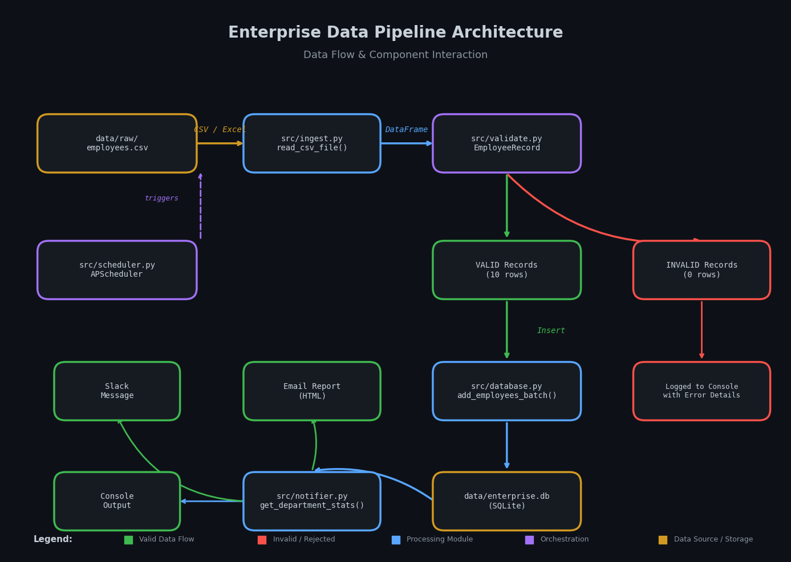

# Enterprise Data Pipeline & Automation Tool

A production-grade Python automation system that ingests enterprise data, validates it, stores it in a database, and generates automated reports.

**Built for:** Apple's IS&T team (enterprise applications, data platforms, AI integration)

---

## What It Does



1. **Ingests** CSV/Excel files from the `data/raw/` folder
2. **Validates** data using Pydantic rules (emails, departments, positive salaries)
3. **Stores** clean data in SQLite with duplicate handling
4. **Reports** department statistics and pipeline summaries via console/email/Slack
5. **Schedules** automatic runs using APScheduler (daily, hourly, or on-demand)

---

## Tech Stack

| Technology | Purpose |
|-----------|---------|
| **Python 3.12** | Core language |
| **Pandas** | Data manipulation & CSV/Excel reading |
| **Pydantic** | Data validation with strict type checking |
| **SQLAlchemy** | ORM for database operations |
| **SQLite** | File-based database (zero server setup) |
| **APScheduler** | Background task scheduling |
| **smtplib/requests** | Email & Slack notifications |

---

## Project Structure

enterprise-data-pipeline/
├── README.md                 # This file
├── requirements.txt          # Python dependencies
├── run_scheduler.py         # Entry point: run pipeline on schedule
├── config/
│   └── settings.py          # Database paths, email credentials
├── data/
│   ├── raw/                 # Drop CSV/Excel files here
│   ├── processed/           # Cleaned data backups
│   └── enterprise.db        # SQLite database (auto-created)
├── src/
│   ├── init.py
│   ├── main.py              # Pipeline orchestrator
│   ├── ingest.py            # File reading (CSV/Excel)
│   ├── validate.py          # Data validation rules
│   ├── database.py          # Database CRUD operations
│   ├── scheduler.py         # APScheduler wrapper
│   └── notifier.py          # Email/Slack reporting
├── tests/
│   ├── test_ingest.py       # Tests file reading
│   ├── test_validate.py     # Tests validation rules
│   └── test_database.py     # Tests database operations
└── docs/
└── architecture.md      # Detailed architecture notes

---

## Quick Start

### 1. Clone & Setup

```bash
# Clone the repository
git clone https://github.com/YOUR_USERNAME/enterprise-data-pipeline.git
cd enterprise-data-pipeline

# Create virtual environment
python3.12 -m venv venv
source venv/bin/activate  # On Windows: venv\Scripts\activate

# Install dependencies
pip install -r requirements.txt

```
### 2. Run the Pipeline

```bash
# Run once immediately
python run_scheduler.py now

# Run on a schedule (examples)
python run_scheduler.py daily     # Every day at 9:00 AM
python run_scheduler.py hourly    # Every hour
python run_scheduler.py minute    # Every minute (testing only)
```
### 3. Add Your Data

Drop a CSV or Excel file into data/raw/ with these columns:
    name — Employee full name
    email — Valid email address
    department — One of: Engineering, Sales, Marketing, HR, Finance, Operations, Legal, IT
    salary — Positive number
    employee_id (optional)

Example:
csv
name,email,department,salary,employee_id
Alice Johnson,alice@apple.com,Engineering,125000,E001
Bob Smith,bob@apple.com,Sales,95000,E002

---

### How It Works (Detailed Flow)

Step 1: Ingestion (src/ingest.py)
- Reads CSV/Excel using Pandas
- Validates file existence and format
- Returns a clean DataFrame

Step 2: Validation (src/validate.py)
- Uses Pydantic models to enforce strict rules:
    EmailStr ensures valid email format
    Field(gt=0) ensures positive salary
        Custom validators check department names and non-blank names
- Separates valid records from invalid ones
- Reports exactly which rows failed and why

Step 3: Database Storage (src/database.py)
- SQLAlchemy ORM maps Python objects to database tables
- Duplicate handling: Checks if email exists before inserting
- Statistics: Computes department-level aggregations (count, avg salary, total)

Step 4: Notification (src/notifier.py)
- Console report: Always prints summary to terminal
- Email report: HTML-formatted email with full statistics (configure SMTP)
- Slack report: Simple text messages to channel (configure webhook)

Step 5: Scheduling (src/scheduler.py)
- APScheduler runs jobs in the background
- Supports cron-style (daily at 9 AM) or interval-style (every hour)
- Logs all runs with timestamps and success/failure status

---

### Testing

Run the test suite:
```bash
# Test data ingestion
python tests/test_ingest.py

# Test validation rules
python tests/test_validate.py

# Test database operations
python tests/test_database.py
```
All tests are self-contained and create temporary files/databases that clean up automatically.

| Apple JD Requirement          | How This Project Demonstrates It                                             |
| ----------------------------- | ---------------------------------------------------------------------------- |
| **Enterprise applications**   | Built a complete data processing application with modular architecture       |
| **Data services**             | Handles ingestion, validation, storage, and reporting end-to-end             |
| **Global complexity & scale** | Duplicate handling, error resilience, batch processing, scheduled automation |
| **APIs & integration**        | Slack webhook integration, SMTP email, extensible for REST APIs              |
| **Documentation**             | Comprehensive README, inline docstrings, architecture notes                  |

---

### Future Enhancements
• [ ] REST API layer (FastAPI) for real-time data submission
• [ ] PostgreSQL migration for production scale
• [ ] Docker containerization for deployment
• [ ] Cloud storage integration (S3) for raw files
• [ ] Machine learning pipeline for data anomaly detection

---

### License
MIT License — free to use and modify.